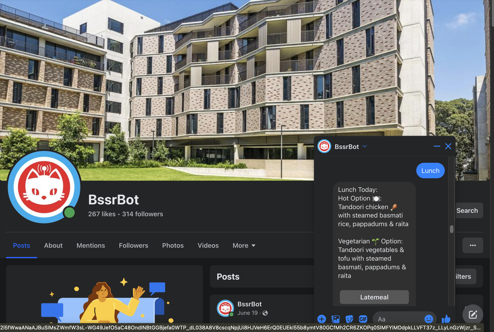
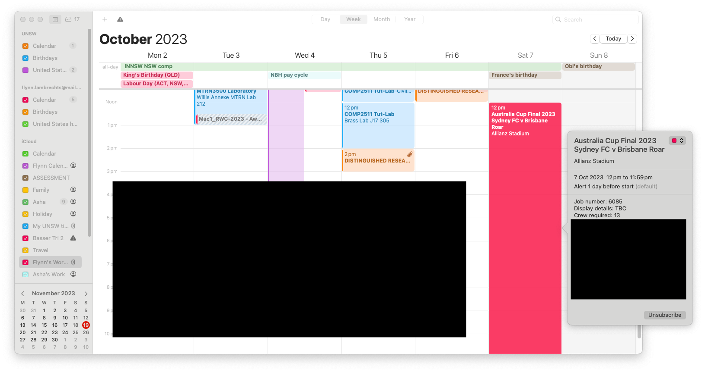

# Stats

# Languages

# Frameworks

# Some Projects
## cselink
A command line tool for UNSW CSE Students. This enables local development with ease of access to cse programs like 'autotest' and 'give'. Providing users with access to the comfort of their own programming environment and the ability to work offline and sync later.

[Repo](https://github.com/flynnlambrechts/cselink)

## BssrBot

[Github](https://github.com/flynnlambrechts/bssrbot3)
[Facebook](https://www.facebook.com/BssrBot1)

Notes:
- 890 Users after a year and a half
- Still Running but on different code base [here](https://github.com/BssrBot/bssrbot4)
- Postgresql db for users
- Hosted on heroku

## Shift Reminder

Notes:
- Adds my work shifts to my calendar from my works google sheets document

# Uni Projects
## Slackr
- COMP6080 Vanilla JS Website 
## Airbrb
- COMP6080 React Website
## Bananagrams Engine [repo](https://github.com/flynnlambrechts/bananagrams_engine_comp3821)
- COMP3821 Project

<!--
**flynnlambrechts/flynnlambrechts** is a ✨ _special_ ✨ repository because its `README.md` (this file) appears on your GitHub profile.

Here are some ideas to get you started:

- 🔭 I’m currently working on ...
- 🌱 I’m currently learning ...
- 👯 I’m looking to collaborate on ...
- 🤔 I’m looking for help with ...
- 💬 Ask me about ...
- 📫 How to reach me: ...
- 😄 Pronouns: ...
- ⚡ Fun fact: ...
-->
